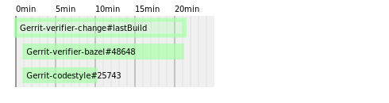

jenkins-build-analyzer
======================

This script takes care of analyzing Jenkins builds and sub-builds logs and show them on a time plot.

It allows to visually show bottlenecks in CI environments.



Very much inspired by [systemd-analyze](https://www.freedesktop.org/software/systemd/man/systemd-analyze.html) plotting function.

How to run
----------

1. Clone from this repository
```
git clone https://github.com/swi-infra/jenkins-build-analyzer
cd jenkins-build-analyzer
```

2. Install dependencies
```
pip install -r requirements.txt
```

3. Run against an existing Jenkins build
```
./analyze --url https://gerrit-ci.gerritforge.com/job/Gerrit-master/3185/ \
          --output test.svg
```
OR
```
./analyze --url https://gerrit-ci.gerritforge.com/job/Gerrit-master/3185/ \
          --output test.png
```
OR
```
./analyze --url https://gerrit-ci.gerritforge.com \
          --job Gerrit-verifier-change \
          --build 24508 \
          --output test.svg
```

